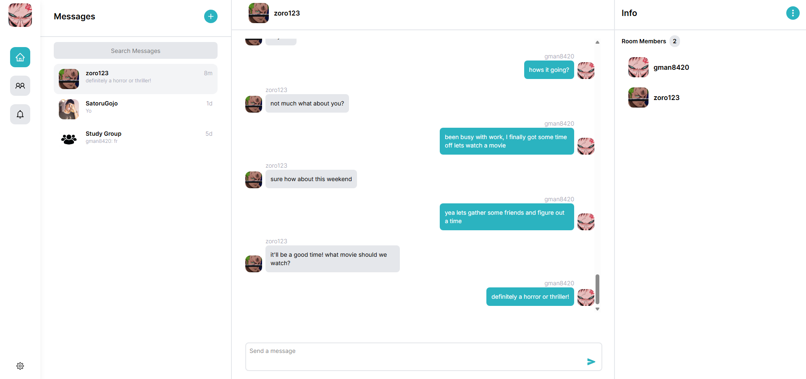

<div align="center">

<a href="https://chathaven.app" target="_blank" title="ChatHaven Website"></a>

# ChatHaven

 A full-stack web application that allows users to seamlessly connect, and chat with their friends.<br/>Built using **MongoDB**, **Express.js**, **Vite (React + TypeScript)**, **Node.js**<br/>and **TailwindCSS** for a clean, responsive UI.


[](https://chathaven.app)



 
</div>

## Features


- User authentication with JWT + refresh tokens
- Protected routes for secure navigation
- Add and manage friends with user search functionality
- Create private chat rooms and invite friends to join
- Real-time messaging with WebSocket (Socket.IO)
- Persistent chat history using MongoDB
- Mobile-responsive UI with TailwindCSS

## Installation

[Node.js](https://nodejs.org/en) and a preferred code editor of choice like [VS Code](https://code.visualstudio.com/download) are required for this installation.

First, clone the repository.

```git clone https://github.com/JDhillon24/ChatHaven.git```

Open a terminal in your preferred editor of choice and run

```
# Start the backend
cd backend
npm install
npm run dev

## In a separate terminal, start the frontend
cd frontend
npm install
npm run dev
```
The backend and frontend should now be running locally on your machine at localhost:5000 and localhost:5173, respectively.
<br/>

**NOTE:** Some environment variables are required on the frontend and backend.

### Frontend
```
VITE_API_URL=URL_OF_YOUR_BACKEND_API
VITE_SOCKET_URL=SAME_AS_ABOVE_URL
```

### Backend
```
ACCESS_TOKEN_SECRET=YOUR_ACCESS_TOKEN_SECRET
MONGODB_URI=YOUR_MONGODB_CONNECION_STRING
REFRESH_TOKEN_SECRET=YOUR_REFRESH_TOKEN_SECRET
EMAIL_USER=EMAIL_FOR_SENDING_VERIFY_OR_RESET_EMAILS
EMAIL_PASS=PASSKEY_FOR_ABOVE_EMAIL
```

## Future Improvements

- **Typing indicators** to show when a user is composing a message
- **Message reactions** (e.g., emojis) to enhance interaction
- **Online/offline presence status**
- **Message read receipts** for more detailed message tracking

## Contact

If you'd like to connect or have any questions about the project, feel free to reach out:<br/>

[](https://www.linkedin.com/in/jdhillon24)

[](https://github.com/JDhillon24)

